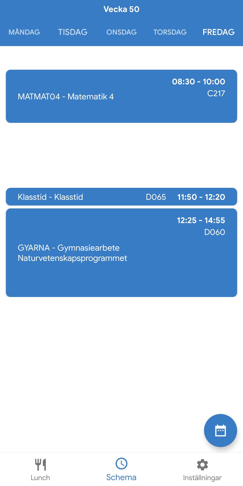
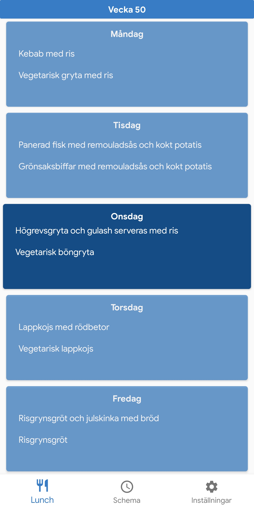

# Blatzarsoft

Blatzarsoft is a free and open source app to easily view schedule and lunch in the same app.
All traffic is done with only the official Schoolsoft servers, to retreive your info and nothing else.

  

### Features

- [x] Week switcher
- [x] Settings
- [x] Dark mode
- [ ] Log out button
- [x] Colors for lessons
- [x] More language support (English and Swedish)
- [ ] Upload to play store
- [ ] Multiple account support
